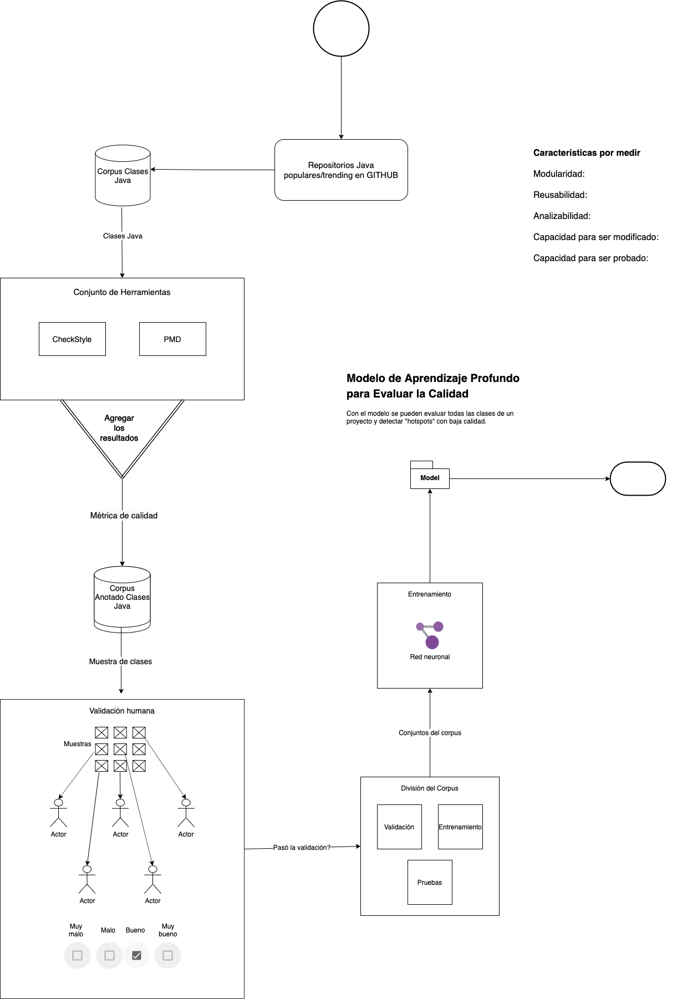

# code-quality-checker
PoC for a Java code quality checker using ML4SC and PMD and CheckStyle rules and metrics

## Process
1. Download Popular Github Projects and extract Java their files
    - Topics - Java: https://github.com/topics/java?l=java&o=desc&s=stars (like most and fewest stars)
    - Trending: https://github.com/trending/java?since=monthly&spoken_language_code=en
1. Run static code analyzers to find if they comply with certain rules (eligibility aspects)
    - CheckStyle -  Filtered interesting rules/metrics
        1. Empty Blocks (D)
        1. Empty Catch Blocks (C)
        1. Empty Statements
        1. FallThrough in Switch Statements
        1. MagicNumber (E)
        1. MultipleStringLiterals (B)
        1. NestedForDepth
        1. NestedIfDepth (A)
        1. NestedTryDepth
        1. OneStatementPerLine
        1. OverloadMethodsDeclarationOrder
        1. ReturnCount
        1. SimplifyBooleanExpression (G)
        1. SimplifyBooleanReturn (F)
        1. BooleanExpressionComplexity
        1. CyclomaticComplexity (H)
        1. Indentation
        1. UncommentedMain
        1. ConstantName: A constant is a static and final field
        1. IllegalIdentifierName (I): Checks identifiers with a regular expression for a set of illegal names, such as those that are restricted or contextual keywords. 
        1. MethodName (~J): checks if a method has the same name as the class. 
        1. ParameterName (K)
        1. MethodCount (L): Checks the number of methods declared in each type declaration by access modifier or total count (default 100)
        1. MethodLength (M)
        1. ParameterNumber (N)
    - PMD -  Filtered interesting rules/metrics
        1. AvoidReassigningLoopVariables
        1. AvoidReassigningParameters
        1. LooseCoupling: Whenever available, referencing objects by their interface types (i.e, Set) provides much more flexibility.
        1. PreserveStackTrace
        1. BooleanGetMethodName
        1. ClassNamingConventions: name conventions
        1. ConfusingTernary: Avoid negation within an "if" expression with an "else" clause. For example, rephrase: if (x != y) diff(); else same(); as: if (x == y) same(); else diff();.
        1. ControlStatementBraces: Enforce a policy for braces on control statements. It is recommended to use braces on ‘if … else’ statements and loop statements, even if they are optional.
        1. EmptyMethodInAbstractClassShouldBeAbstract
        1. FieldDeclarationsShouldBeAtStartOfClass
        1. FieldNamingConventions (I)
        1. FormalParameterNamingConventions (K)
        1. LinguisticNaming: It checks for fields, that are named, as if they should be boolean but have a different type. It also checks for methods, that according to their name, should return a boolean, but don’t. Further, it checks, that getters return something and setters won’t. Finally, it checks that methods, that start with "to" - so called transform methods - actually return something, since according to their name, they should convert or transform one object into another. 
        1. ShortClassName
        1. ShortMethodName
        1. ShortVariable
        1. UseUnderscoresInNumericLiterals
        1. AvoidDeeplyNestedIfStmts (A)
        1. CollapsibleIfStatements: Sometimes two consecutive ‘if’ statements can be consolidated by separating their conditions with a boolean short-circuit operator.
        1. CouplingBetweenObjects: This rule counts the number of unique attributes, local variables, and return types within an object. A number higher than the specified threshold can indicate a high degree of coupling.
        1. CyclomaticComplexity (H)
        1. ExcessiveMethodLength (default 100 lines) (M)
        1. ExcessiveParameterList (default 10 params) (N)
        1. ExcessivePublicCount (default 45) (L)
        1. GodClass?
        1. LogicInversion: Use opposite operator instead of negating the whole expression with a logic complement operator.
        1. NcssCount
        1. SimplifiedTernary: Look for ternary operators with the form condition ? literalBoolean : foo or condition ? foo : literalBoolean.
        1. SimplifyBooleanExpressions (G)
        1. SimplifyBooleanReturns (F)
        1. SingularField: Fields whose scopes are limited to just single methods do not rely on the containing object to provide them to other methods. They may be better implemented as local variables within those methods.
        1. TooManyFields
        1. TooManyMethods (L)
        1. UseObjectForClearerAPI: When you write a public method, you should be thinking in terms of an API. If you pass a lot of information as a simple series of Strings, you may think of using an Object to represent all those information.
        1. AvoidDuplicateLiterals (B)
        1. AvoidFieldNameMatchingMethodName (~J)
        1. AvoidLiteralsInIfCondition (E)
        1. EmptyCatchBlock (C)
        1. EmptyIfStmt (D)
        1. EmptyStatementBlock (D)
        1. EmptySwitchStatements (D)
        1. EmptyTryBlock (D)
        1. EmptyWhileStmt (D)
        1. IdempotentOperations: Avoid idempotent operations - they have no effect.
        1. JumbledIncrementer: Avoid jumbled loop incrementers - its usually a mistake, and is confusing even if intentional.
        1. UnconditionalIfStatement: Do not use "if" statements whose conditionals are always true or always false.
1. Based on the rules detection do the following
    1. For example with `ShortMethodName`, there will be many with the rule violated/detected and many with no violation of this type. 
    With that we will have positive and negative samples to train a neural network.
    1. Generate a dataset with classes divided in three sets: training, validation and testing.
    1. Train a neural network and generate a model to recognize the rule/metric.
    1. Repeat the process for the rules/metrics you're interested in.
1. After having some models, we can generate a tool to assess the general 'Legibility' of a project by analyzing its classes and reporting the 'low-quality hot spots'.

[Can also aggregate results and generate a unique metric and explain what it does take into consideration]
For example if we consider:
1. TooManyFields
1. TooManyMethods
1. ShortClassName
1. ShortMethodName
1. ShortVariable

We have 5 rules, and can give the same importance to all of them (20%). Then let's say we want to decrease the legibility by 20% with each violation.
So, for a class violating `TooManyFields` and `ShortClassName` it'd be a 40% decrease resulting in an 'Overall Legibility' of 60%. 
We can then use human validation to review that the aggregated score the classes make sense. And continue to the Corpus division for the training and generation of the model. 

     
## Process Diagram

    
    
    
    

    

## Requirements
Code Quality Checker requires:
- a
- b
- c

## Install

### Usage

## Development

## License
